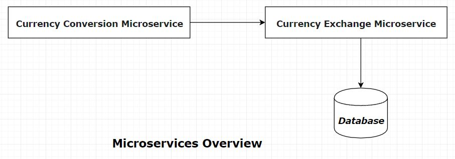
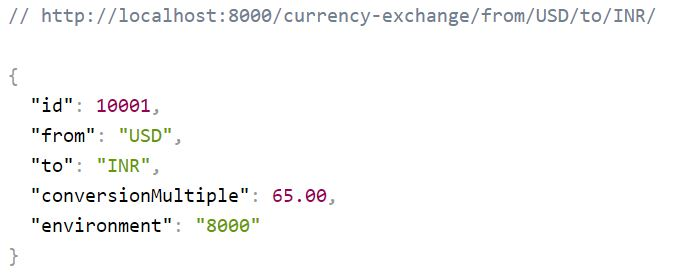
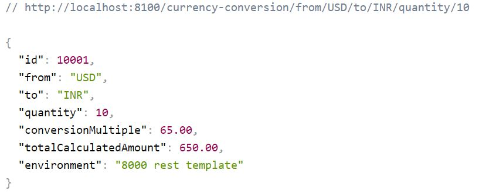

# Currency Conversion & Exchange Microservices

## Microservices Overview

## 1. Currency Exchange Microservice
> **Provides an exchange rate from one currency to another.**

## 2. Currency Conversion Microservice
> **Coverts given quantity from one currency to another**

## Ports
| Application      | Port |
| ----------- | ----------- |
| Currency Converter Service | 8100        |
| Currency Exchange Service  | 8000, 8001|

## URLs
| Application      | URL |
| ----------- | ----------- |
| Currency Converter Service - Direct Call      | http://localhost:8100/currency-conversion/from/USD/to/INR/quantity/10        |
| Currency Converter Service - Feign   | http://localhost:8100/currency-conversion-feign/from/EUR/to/INR/quantity/10000        |
| Currency Exchange Service  | http://localhost:8000/currency-exchange/from/EUR/to/INR , http://localhost:8001/currency-exchange/from/EUR/to/INR         |

## VM Argument
-Dserver.port=8001

## Running Examples
* Download the zip or clone the Git repository.
* Unzip the zip file (if you downloaded one)
* Open Command Prompt and Change directory (cd) to folder containing pom.xml
* Open Command Prompt and Change directory (cd) to folder containing pom.xml
  * Open Eclipse
  * File -> Import -> Existing Maven Project -> Navigate to the folder where you unzipped the zip
  * Select the right project
* Choose the Spring Boot Application file (search for @SpringBootApplication)
* Right Click on the file and Run as Java Application 